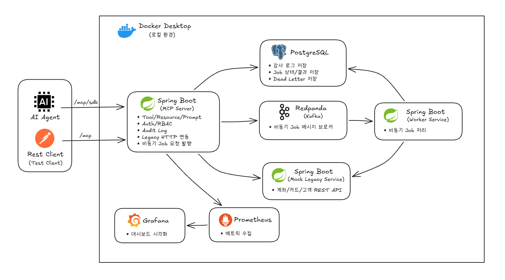

# 은행 Agent MCP Server 표준 PoC

## 개요

은행 Agent가 내부 업무 시스템을 MCP 표준 인터페이스로 호출하는 상황을 가정한 **MCP 서버 표준 구조 개인 기술검증 포트폴리오**입니다.

Spring Boot 기반 MCP 서버, Kafka 기반 비동기 작업 처리, REST 방식의 레거시 연동, 권한 제어, 감사 로그, 운영 조회 API, 컨테이너 실행 환경을 하나의 PoC로 검증합니다.

실제 금융사명, 실제 고객명, 실제 계좌번호, 실제 업무 전문, 실제 인증서/키는 사용하지 않습니다. 모든 데이터는 mock 데이터입니다.

## 목적

이 프로젝트의 목적은 은행 Agent 개발 과제에서 요구되는 MCP 서버 표준 구조, Java/Spring Boot 백엔드, Kafka 기반 비동기 메시지 처리, REST 레거시 연동, 서비스 분리, 감사 로그, 권한 제어, 컨테이너 운영 구성을 실제 코드로 검증하는 것입니다.

## 시스템 아키텍처



## 핵심 요약

- Spring Boot 3.x 기반 MCP 서버 표준 구조 PoC
- Spring AI MCP WebMVC starter 기반 `/mcp/sdk` 표준 MCP 호출 경로 제공
- JSON-RPC `/mcp` 경로로 Tool 호출 흐름 회귀 테스트 지원
- MCP Tool, Resource, Prompt 표준 메타데이터 구성
- MCP 서버, 비동기 Worker, 레거시 Mock 서비스를 별도 Spring Boot 서비스로 분리
- Spring Kafka와 Redpanda로 비동기 작업 요청/처리 구조 구현
- PostgreSQL과 Flyway로 감사 로그, 비동기 작업 상태, 실패 메시지 영속 저장
- Mock API key/Bearer token 인증과 역할/권한 기반 접근 제어 적용
- Docker Compose로 MCP 서버, Worker, 레거시 Mock, PostgreSQL, Redpanda, Prometheus, Grafana 통합 실행

## 모듈 구성

| 모듈 | 역할 |
| --- | --- |
| `legacy-api` | 서비스 간 레거시 REST 연동에 사용하는 공통 DTO |
| `mcp-server` | MCP 요청 접수, 인증/인가, 감사 로그 저장, 비동기 작업 접수 |
| `worker-service` | Kafka 메시지 소비, 비동기 작업 처리, 작업 상태 변경, 레거시 HTTP 호출 |
| `mock-legacy-service` | 외부 레거시 시스템을 대체하는 mock REST API |

## 구현 범위

| 영역 | 구현 내용 |
| --- | --- |
| MCP | Spring AI MCP `/mcp/sdk`, JSON-RPC `/mcp` |
| Tool | `account_summary`, `card_transaction_search`, `loan_product_recommend`, `customer_ticket_create`, `customer_ticket_create_async`, `async_job_status` |
| Resource/Prompt | 스키마, 접근 정책, Kafka topic 정보, 상담/상품/이상거래 검토 프롬프트 |
| 권한 | USER, ADVISOR, ADMIN 역할과 세부 권한 기반 접근 제어 |
| 레거시 연동 | MCP 서버와 Worker가 HTTP 연동 계층으로 `mock-legacy-service` 호출 |
| 비동기 처리 | `agent.job.requested` 메시지 발행/소비, Worker 서비스 처리 |
| 감사/운영 | PostgreSQL 감사 로그, 작업 상태, 실패 메시지 조회 |
| 실행 환경 | Docker Compose, PostgreSQL, Redpanda, Prometheus, Grafana |

## 기술 선택 이유

| 기술 | 선택 이유 |
| --- | --- |
| Spring Boot 3.x | Java 기반 MCP/REST 백엔드 구현 역량 검증 |
| Spring AI MCP WebMVC | Spring 환경에서 표준 MCP 호출 경로 제공 |
| JSON-RPC `/mcp` | MCP SDK 경로와 별도로 Tool 호출 흐름을 단순하게 회귀 테스트 |
| Spring Kafka + Redpanda | Kafka 호환 브로커로 비동기 작업 요청/처리 구조 검증 |
| PostgreSQL + Flyway | 감사 로그, 작업 상태, 실패 메시지를 운영형 스키마로 영속 저장 |
| Mock Legacy Service | 실제 금융 시스템 없이 REST 기반 레거시 연동 구조 재현 |
| 세부 권한 기반 접근 제어 | 단순 역할 계층을 넘어 Tool/Resource별 권한 확장 가능성 확보 |
| Prometheus/Grafana | 애플리케이션 지표 수집과 기본 대시보드 자동 구성 |
| Docker Compose | 여러 서비스를 한 번에 실행하는 로컬 통합 환경 구성 |

## 주요 처리 흐름

### 동기 Tool 호출

```text
POST /mcp tools/call
  -> 인증 정보 확인
  -> 권한 검사
  -> mcp-server의 업무 서비스 호출
  -> HTTP 연동 계층으로 mock-legacy-service 호출
  -> audit_events에 감사 로그 저장
  -> MCP 응답 반환
```

### 비동기 Tool 호출

```text
customer_ticket_create_async
  -> mcp-server가 agent_jobs에 PENDING 상태 저장
  -> Kafka agent.job.requested 메시지 발행
  -> worker-service가 메시지 소비
  -> agent_jobs를 RUNNING 상태로 변경
  -> mock-legacy-service 티켓 생성 API 호출
  -> agent_jobs를 COMPLETED 또는 FAILED 상태로 변경
  -> async_job_status로 결과 조회
```

업무 처리 실패와 메시지 소비 실패는 분리해서 저장합니다.

```text
업무 처리 실패
  -> agent_jobs.status = FAILED

메시지 소비 실패
  -> kafka_dead_letters에 원본 메시지 저장
```

## 실행 방법

### 필수 조건

- [Docker Desktop](https://www.docker.com/products/docker-desktop/)을 설치하고 실행 중이어야 합니다. Docker Desktop에는 Docker Compose(`docker compose`)가 포함되어 있습니다.
- 최초 실행 시 Docker 이미지 다운로드를 위한 인터넷 연결이 필요합니다.

### 1. 전체 서비스 실행

```bash
docker compose up --build
```

백그라운드 실행:

```bash
docker compose up --build -d
```

`mcp-server`, `worker-service`, `mock-legacy-service`, PostgreSQL, Redpanda, Prometheus, Grafana가 함께 실행됩니다. 기본 로컬 실행에 필요한 설정값은 `docker-compose.yml`에 포함되어 있어 `.env` 파일 없이 실행할 수 있습니다.

### 2. 실행 확인

```bash
docker compose ps
```

주요 컨테이너가 `Up` 상태이면 전체 서비스가 정상적으로 시작된 상태입니다.

API 응답까지 확인하려면 다음 명령을 사용합니다.

```bash
curl http://localhost:8080/actuator/health
curl http://localhost:8081/actuator/health
curl http://localhost:8082/actuator/health
```

### 3. 서비스 종료

```bash
docker compose down
```

컨테이너를 종료하되 PostgreSQL, Prometheus, Grafana 데이터는 Docker named volume에 유지됩니다.

개발 데이터를 모두 초기화하려면 volume까지 삭제합니다.

```bash
docker compose down -v
```

## 로컬 포트 참고

| 서비스 | 주소 | 용도 |
| --- | --- | --- |
| MCP Server | <http://localhost:8080> | MCP/REST API |
| Mock Legacy Service | <http://localhost:8081> | mock legacy REST API |
| Worker Service | <http://localhost:8082> | 비동기 작업 Worker 상태/지표 |
| PostgreSQL | `localhost:5432` | DB 클라이언트 접속용 |
| Redpanda | `localhost:9092` | Kafka 호환 메시지 브로커 |
| Prometheus | <http://localhost:9090> | 지표 조회 |
| Grafana | <http://localhost:3000> | 기본 대시보드 (`admin` / `admin`) |

## 인증

현재는 실제 JWT/JWK를 사용하지 않고 mock API key 또는 mock Bearer token으로 인증합니다.

| API key | Bearer token | Role | 접근 범위 |
| --- | --- | --- | --- |
| `mock-user-key` | `mock-user-token` | USER | 계좌/카드 조회, 비동기 작업 상태 조회 |
| `mock-advisor-key` | `mock-advisor-token` | ADVISOR | USER 권한 + 대출 추천, 상담 티켓 생성 |
| `mock-admin-key` | `mock-admin-token` | ADMIN | 전체 Tool/Resource, 감사/운영 조회 |

## MCP 호출 예시

### tools/list

```bash
curl -X POST http://localhost:8080/mcp \
  -H "Content-Type: application/json" \
  -d '{"jsonrpc":"2.0","id":"1","method":"tools/list","params":{}}'
```

### account_summary

```bash
curl -X POST http://localhost:8080/mcp \
  -H "Content-Type: application/json" \
  -H "X-Api-Key: mock-user-key" \
  -d '{"jsonrpc":"2.0","id":"2","method":"tools/call","params":{"name":"account_summary","arguments":{"accountId":"ACC-1001"}}}'
```

### 권한 거부

`loan_product_recommend`는 ADVISOR 이상 권한이 필요합니다.

```bash
curl -X POST http://localhost:8080/mcp \
  -H "Content-Type: application/json" \
  -H "X-Api-Key: mock-user-key" \
  -d '{"jsonrpc":"2.0","id":"3","method":"tools/call","params":{"name":"loan_product_recommend","arguments":{"customerId":"CUST-1001"}}}'
```

권한이 없으면 응답의 `error.data.code`가 `ACCESS_DENIED`입니다.

### 비동기 작업

```bash
curl -X POST http://localhost:8080/mcp \
  -H "Content-Type: application/json" \
  -H "X-Api-Key: mock-advisor-key" \
  -d '{"jsonrpc":"2.0","id":"4","method":"tools/call","params":{"name":"customer_ticket_create_async","arguments":{"customerId":"CUST-1001","title":"Mock title","description":"Mock description"}}}'
```

응답의 `jobId`로 상태를 조회합니다.

```bash
curl -X POST http://localhost:8080/mcp \
  -H "Content-Type: application/json" \
  -H "X-Api-Key: mock-user-key" \
  -d '{"jsonrpc":"2.0","id":"5","method":"tools/call","params":{"name":"async_job_status","arguments":{"jobId":"JOB_ID"}}}'
```

## 운영 API

관리자 권한으로 감사 로그, 작업 상태, 비동기 작업 메시지 소비 실패 이력을 조회할 수 있습니다.

```bash
curl "http://localhost:8080/api/v1/audit/events?limit=20" \
  -H "X-Api-Key: mock-admin-key"

curl "http://localhost:8080/api/v1/ops/jobs?status=COMPLETED&limit=20" \
  -H "X-Api-Key: mock-admin-key"

curl "http://localhost:8080/api/v1/ops/dead-letters?topic=agent.job.requested&limit=20" \
  -H "X-Api-Key: mock-admin-key"
```

## API 문서

상세 HTTP/API 요청/응답 예제는 Postman 공개 문서에서 확인할 수 있습니다.

- Postman API 문서: <https://documenter.getpostman.com/view/27762620/2sBXwsLAMD>

> 참고: Postman Web에서 `localhost` API를 실행하려면 Postman Desktop Agent가 필요합니다. Postman Desktop 앱에서 실행하는 경우에는 보통 별도 설정이 필요 없습니다.

로컬에서 직접 import해서 실행하려면 아래 컬렉션과 환경 파일을 사용합니다.

| 파일 | 설명 |
| --- | --- |
| [banking-agent-mcp.postman_collection.json](postman/banking-agent-mcp.postman_collection.json) | MCP Tool/Resource/Prompt, 비동기 작업, 운영 API 요청 모음 |
| [banking-agent-mcp.local.postman_environment.json](postman/banking-agent-mcp.local.postman_environment.json) | 로컬 실행용 URL과 mock API key 환경 변수 |

Postman에서 두 파일을 import한 뒤 `Banking Agent MCP Local` 환경을 선택합니다.

권장 확인 순서:

1. `System / MCP Server Health`
2. `MCP JSON-RPC / tools/list`
3. `MCP JSON-RPC / resources/list`
4. `MCP JSON-RPC / resources/read - account schema`
5. `MCP JSON-RPC / prompts/list`
6. `MCP JSON-RPC / prompts/get - customer consulting summary`
7. `MCP JSON-RPC / account_summary`
8. `MCP JSON-RPC / customer_ticket_create`
9. `MCP JSON-RPC / loan_product_recommend - Access Denied`
10. `Async Job / customer_ticket_create_async`
11. `Async Job / async_job_status`
12. `Ops API / Audit Events`
13. `Ops API / Jobs`
14. `Monitoring / Prometheus UI`
15. `Monitoring / Grafana UI`

`Async Job / customer_ticket_create_async` 요청은 응답의 `jobId`를 `JOB_ID` 환경 변수에 자동 저장합니다. 이후 `Async Job / async_job_status` 요청에서 같은 `JOB_ID`를 사용합니다.

## MCP Inspector 확인

MCP Inspector로 표준 MCP 호출 경로인 `/mcp/sdk`를 확인할 수 있습니다.

MCP Inspector를 실행하려면 Node.js/npm 환경이 필요합니다. `npx`는 npm에 포함되어 있습니다.

```bash
node -v
npm -v
npx -v
```

최초 실행 시 Inspector 패키지를 내려받기 위한 인터넷 연결이 필요합니다. 또한 MCP 서버가 먼저 실행 중이어야 합니다.

```bash
npx @modelcontextprotocol/inspector
```

브라우저에서 Inspector 화면이 열리면 왼쪽 설정 영역에 다음 값을 입력합니다.

| 항목 | 값 |
| --- | --- |
| Transport Type | `Streamable HTTP` |
| URL | `http://localhost:8080/mcp/sdk` |
| Authentication > Custom Headers | `X-Api-Key: mock-user-key` |

이후 `Connect`를 누릅니다.

연결되면 상단의 `Resources`, `Prompts`, `Tools` 탭에서 MCP 서버가 제공하는 항목을 확인할 수 있습니다.

`mock-user-key`로 연결하면 USER 권한 Resource와 Tool을 확인할 수 있습니다. `Access control policy`, `Kafka topic design`처럼 ADMIN 권한이 필요한 Resource를 확인하려면 Custom Headers 값을 `X-Api-Key: mock-admin-key`로 바꾼 뒤 다시 연결합니다.

Tool 실행 예:

1. `Tools` 탭으로 이동합니다.
2. `List Tools`를 눌러 Tool 목록을 확인합니다.
3. `account_summary`를 선택합니다.
4. `accountId`에 `ACC-1001`을 입력합니다.
5. `Run Tool`을 누릅니다.

입력값:

| 항목 | 값 |
| --- | --- |
| `accountId` | `ACC-1001` |

## Prometheus / Grafana

Prometheus는 MCP 서버와 Worker 서비스의 지표 엔드포인트를 수집합니다.

| 대상 | 엔드포인트 |
| --- | --- |
| MCP Server | `app:8080/actuator/prometheus` |
| Worker Service | `worker-service:8082/actuator/prometheus` |

Grafana 확인:

```text
http://localhost:3000
admin / admin
Dashboards > Banking Agent > Banking Agent MCP Overview
```

Grafana에는 Prometheus 데이터소스와 `Banking Agent MCP Overview` 대시보드가 자동으로 등록됩니다.

대시보드에서 확인할 수 있는 항목:

- MCP Server 상태
- Worker Service 상태
- HTTP 요청 처리량
- MCP Tool 호출 수
- JVM Heap 메모리 사용량

## 로컬 테스트

코드 변경 후 로컬에서 검증이 필요할 때 실행합니다.

```bash
mvn test
```

로컬 Maven이 없으면 Docker로 실행할 수 있습니다.

```bash
docker run --rm -v "$PWD":/workspace -w /workspace maven:3.9.9-eclipse-temurin-17 mvn test
```

테스트는 Controller, 권한, 감사 로그, DB 저장소, Worker 작업, mock legacy API를 분리해 검증합니다.

| 테스트 | 검증 범위 |
| --- | --- |
| `McpJsonRpcControllerTest` | `/mcp` JSON-RPC, Tool 호출, 권한, 감사 로그 연동 |
| `SpringAiMcpEndpointTest` | `/mcp/sdk` Tool 호출, Resource read, 권한별 MCP 세션 |
| `AuditControllerTest` | 감사 로그 조회 API |
| `OpsControllerTest` | 작업 상태/실패 메시지 운영 API |
| `PersistenceStoreTest` | JDBC 작업 저장소 상태 전이 |
| `AgentJobWorkerTest` | Worker 작업 성공/실패 전이 |
| `LegacyBankingControllerTest` | mock legacy REST API |

## 설계 포인트

- [MCP Server 표준 설계](docs/MCP_SERVER_STANDARD.md)에 맞춰 Tool/Resource/Prompt 등록부와 Spring AI MCP 연결부를 분리
- [Kafka Topic 설계](docs/KAFKA_TOPIC_DESIGN.md)를 기준으로 비동기 Job 요청 topic, payload, 실패 처리 기준을 정의
- `mcp-server`, `worker-service`, `mock-legacy-service`를 분리해 요청 접수, 비동기 처리, 레거시 연동 책임을 명확화
- Tool 호출 감사는 `audit_events`에 직접 저장하고, Kafka는 실제 비동기 처리가 필요한 작업 요청 중심으로 구성
- `agent_jobs` 상태 저장과 Worker 메시지 소비 구조로 비동기 Tool 요청의 상태/결과를 추적
- `legacy-api` 공통 DTO와 HTTP 연동 계층으로 서비스 간 레거시 연동 경계 표현
- 세부 권한 기반 접근 제어로 Tool/Resource 접근 정책 확장 가능 구조 구성
